# Diagramas de Flujo - EcoProyecto

## Procesos y Flujos de Trabajo del Sistema

---

## 📋 Tabla de Contenido

1. [Flujo General del Sistema](#flujo-general-del-sistema)
2. [Flujo de Gestión de Pacientes](#flujo-de-gestión-de-pacientes)
3. [Flujo de Gestión de Citas](#flujo-de-gestión-de-citas)
4. [Flujo de Generación de Reportes](#flujo-de-generación-de-reportes)
5. [Flujo de Atención al Paciente](#flujo-de-atención-al-paciente)

---

## Flujo General del Sistema

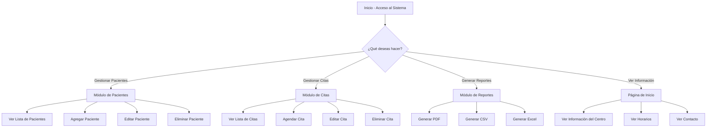

---

## Flujo de Gestión de Pacientes

### Agregar Nuevo Paciente

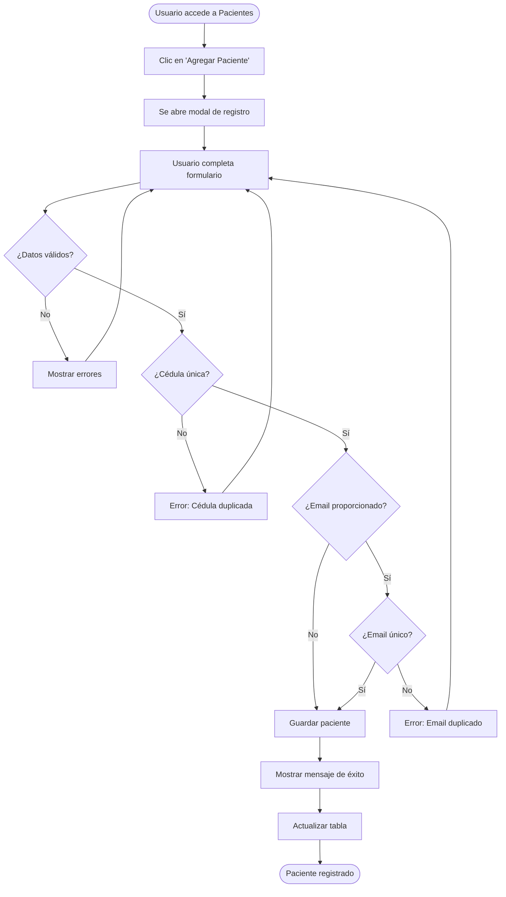

### Editar Paciente Existente

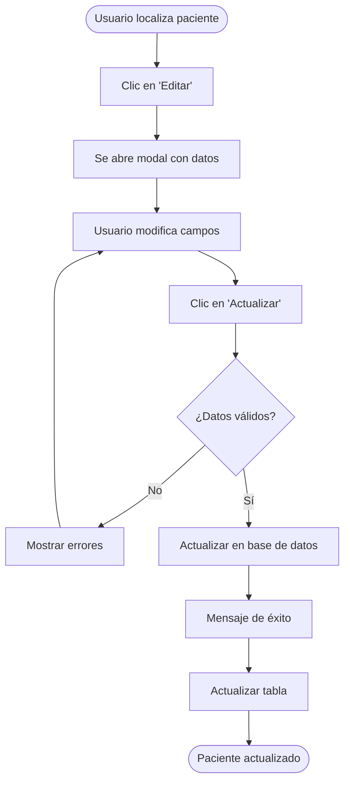

### Eliminar Paciente

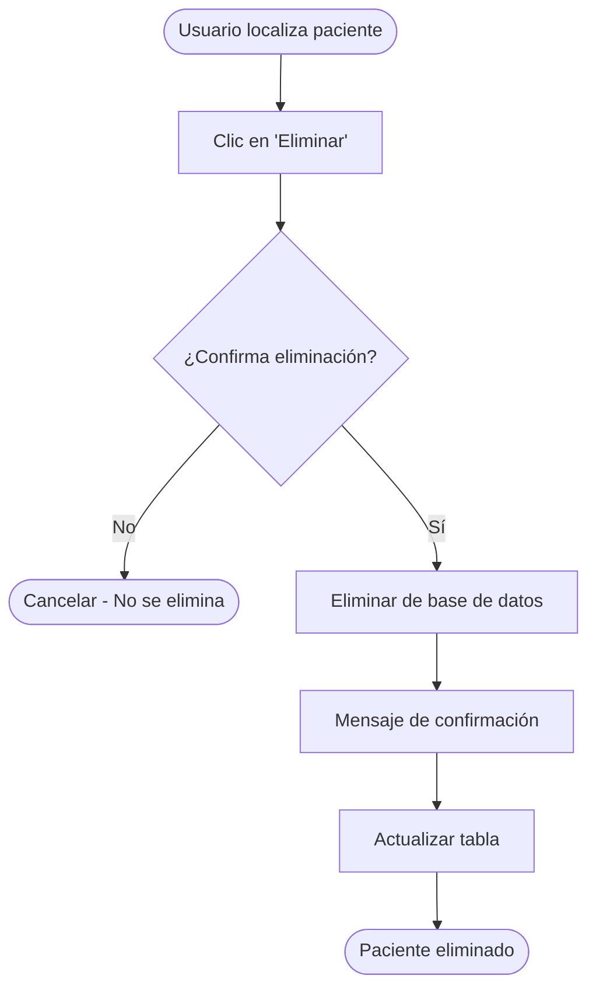

---

## Flujo de Gestión de Citas

### Agendar Nueva Cita

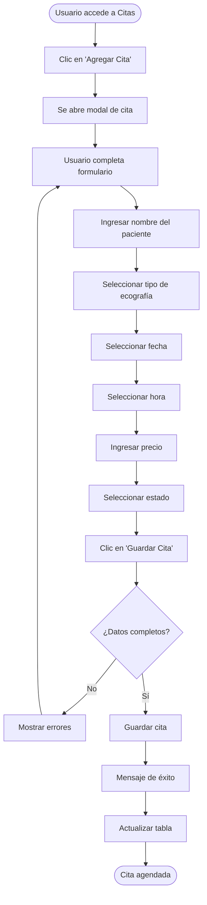

### Actualizar Estado de Cita

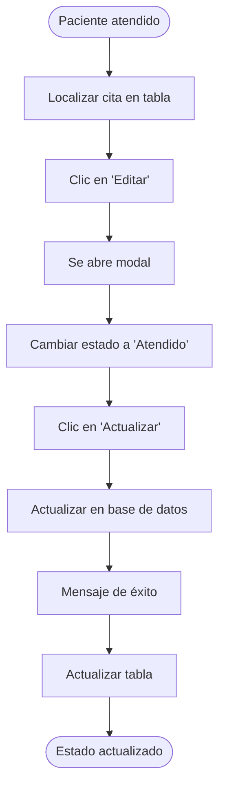

---

## Flujo de Generación de Reportes

### Generar Reporte PDF

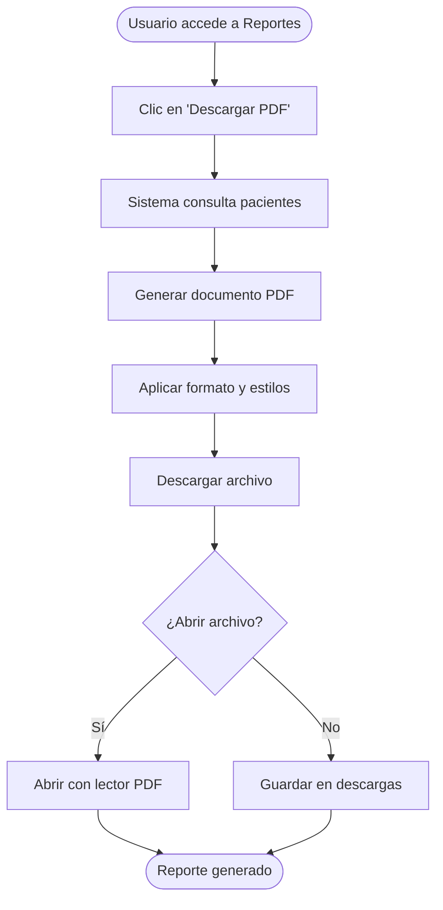

### Generar Reporte CSV

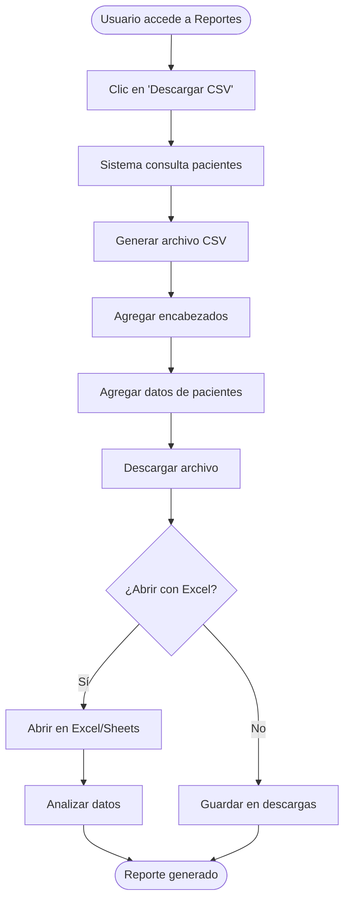

---

## Flujo de Atención al Paciente

### Proceso Completo de Atención

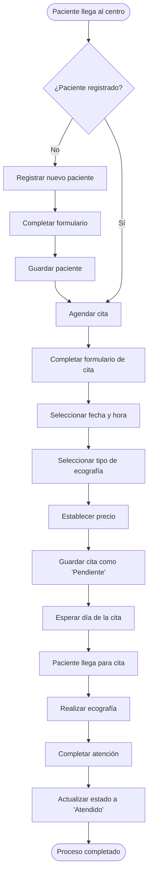

### Flujo de Trabajo Diario del Personal

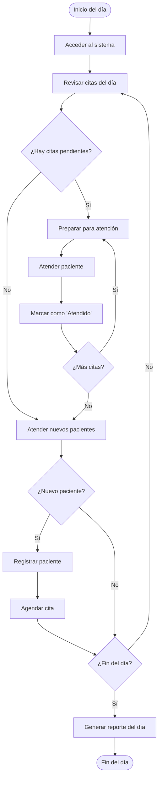

---

## Diagrama de Estados de Cita

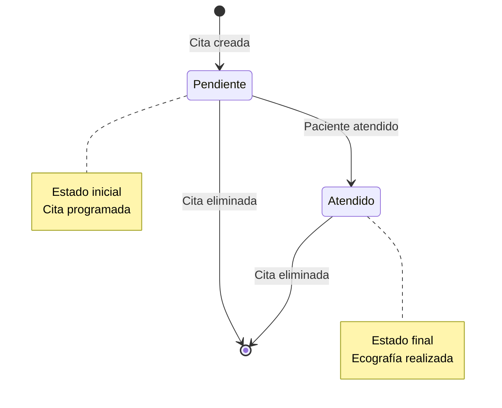

---

## Diagrama de Validaciones

### Validación de Datos de Paciente

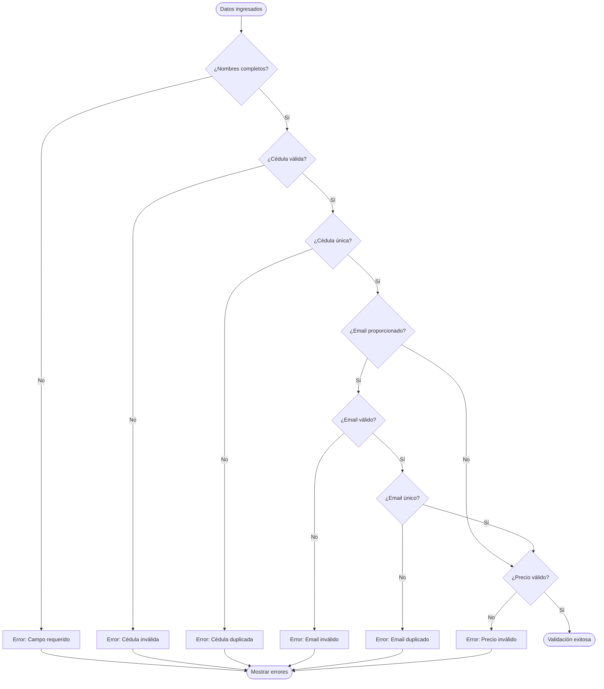

---

## Casos de Uso Principales

### Caso de Uso: Registro de Paciente

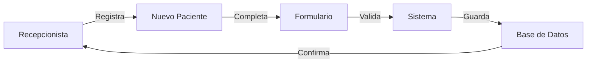

### Caso de Uso: Agendamiento de Cita

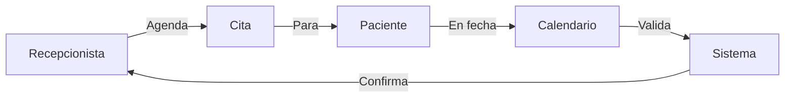

### Caso de Uso: Generación de Reportes

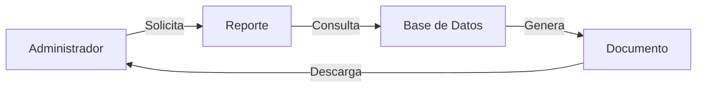

---

## Arquitectura de Navegación

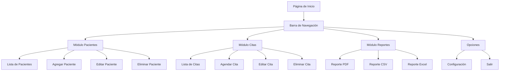

---

## Flujo de Datos

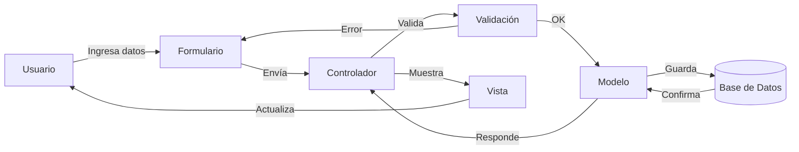

---

## Mejores Prácticas - Flujo de Trabajo

### Rutina Diaria Recomendada

```mermaid
gantt
    title Rutina Diaria del Personal
    dateFormat HH:mm
    axisFormat %H:%M

    section Mañana
    Revisar citas del día           :08:00, 30m
    Atender primeras citas          :08:30, 2h
    Registrar nuevos pacientes      :10:30, 1h

    section Tarde
    Atender citas programadas       :13:00, 3h
    Actualizar estados              :16:00, 30m
    Generar reporte diario          :16:30, 30m

    section Cierre
    Revisar pendientes              :17:00, 30m
    Agendar citas para mañana       :17:30, 30m
```

---

**Versión**: 1.0  
**Última Actualización**: Diciembre 2025

---

_Estos diagramas están en formato Mermaid y se visualizan correctamente en GitHub, GitLab, y editores compatibles con Markdown._
